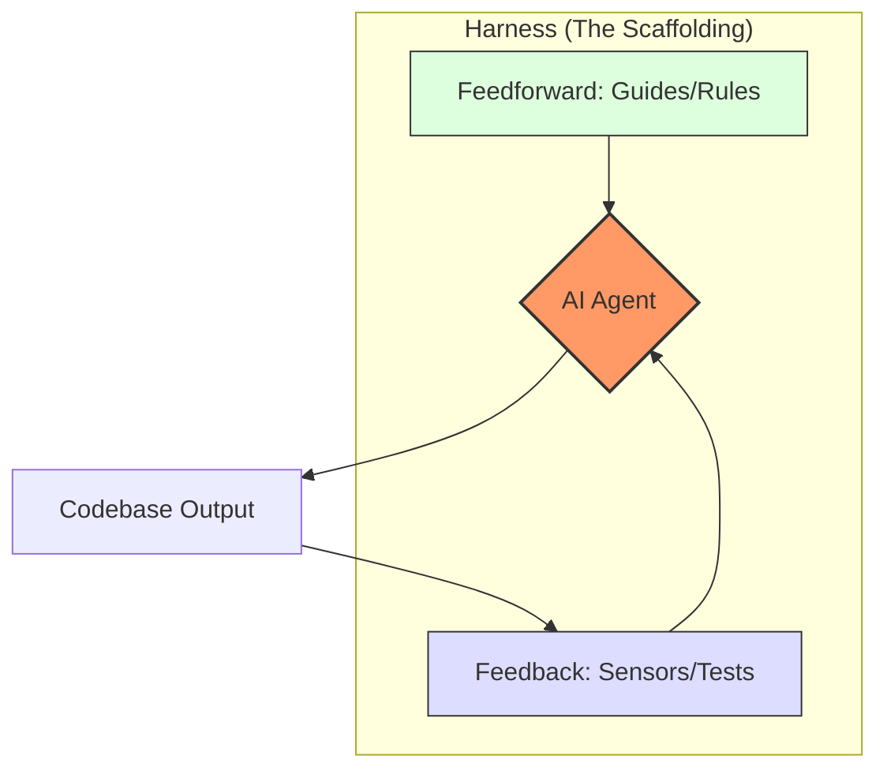
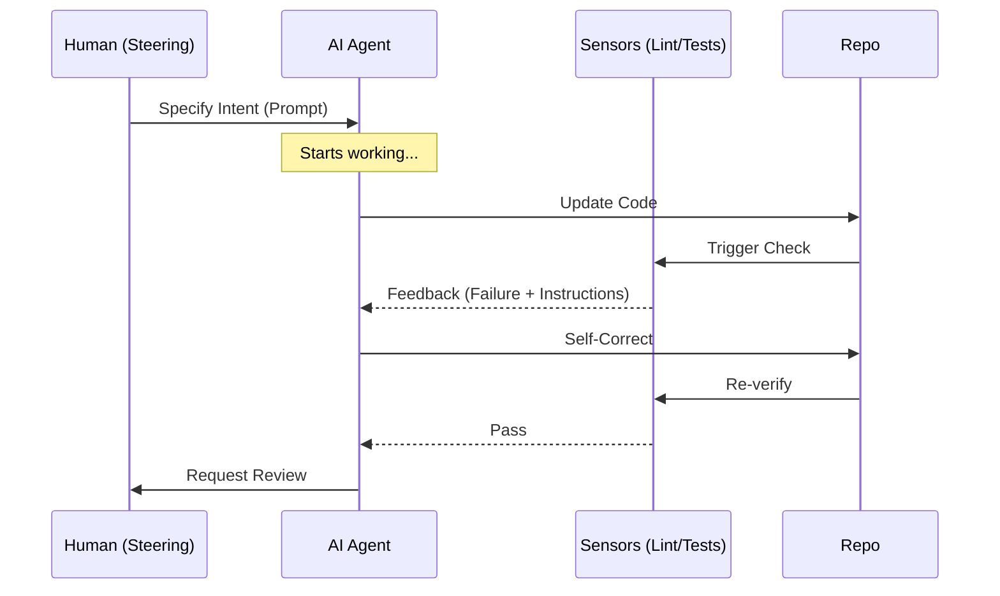
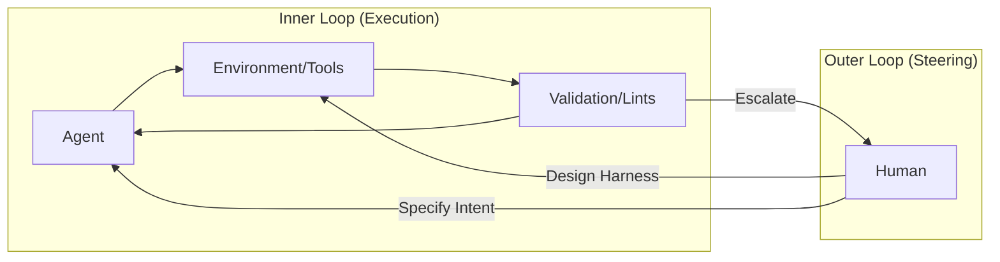
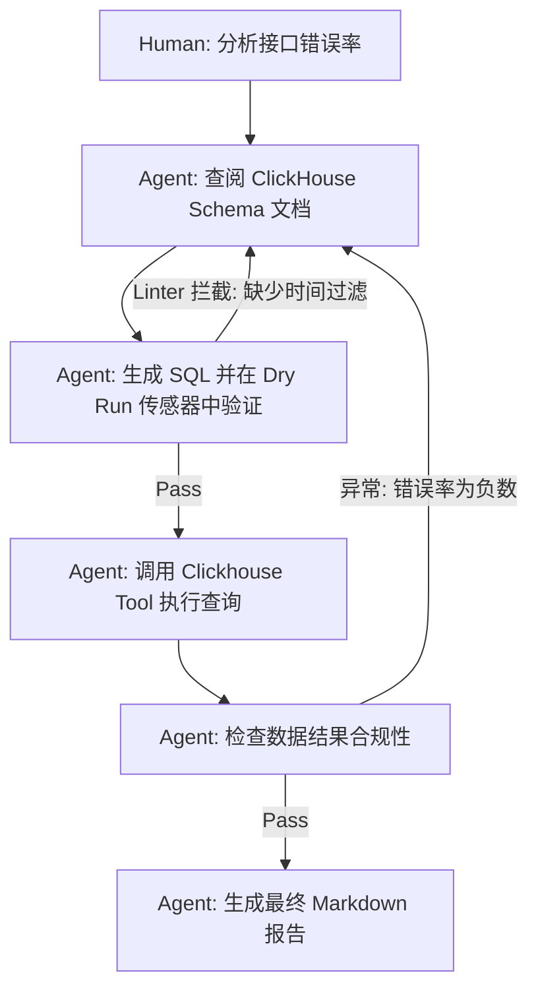

# Harness Engineering: 从理念到行动的调研报告

## 1. 核心理念：什么是 Harness Engineering？

**Harness Engineering（挂载/整装工程）** 是一种将 AI Agent（尤其是编码 Agent）从“黑盒生成器”转变为“可靠生产力工具”的工程实践。

其核心公式为：**Agent = Model + Harness**。

- **Model (模型)**：提供推理和生成的底层大脑。
- **Harness (挂载)**：模型之外的所有基础设施，包括指令（System Prompts）、工具（Tools/MCP）、环境（Environment）、反馈回路（Feedback Loops）和约束机制（Guardrails）。

### 核心目标
- **提高首访正确率**：通过前馈控制（Feedforward）减少偏差。
- **实现自动化纠偏**：通过反馈控制（Feedback）让 Agent 在人类介入前自愈。
- **降低评审负担**：将人类的注意力从“检查语法/格式”转移到“评审架构/意图”。

### 核心架构图 (Mermaid)

---

## 2. 核心机制：前馈与反馈

Harness Engineering 建立在两类调节机制之上：

### A. 前馈控制 (Feedforward / Guides) —— 预防胜于治疗
在 Agent 行动前提供明确的“地图”。
- **计算型 (Computational)**：确定的规则。如：项目模板、代码规范配置文件。
- **推理型 (Inferential)**：语义化的指导。如：`AGENTS.md`、`Skills` 描述、架构决策文档（ADR）。

### B. 反馈控制 (Feedback / Sensors) —— 闭环自愈
在 Agent 行动后通过“传感器”捕获异常并反馈给 Agent。
- **计算型**：Lint 检查、单元测试、类型检查、架构边界测试（ArchUnit）。
- **推理型**：AI 代码评审（LLM-as-Judge）、语义重复检查。
- **关键实践**：将传感器消息优化为“Agent 可读”。例如，Linter 报错不应只是“语法错误”，而应包含“如何修复”的指令。

### 反馈闭环流程图

---

## 3. OpenAI 的实战经验：Harness-First 模式

OpenAI 在内部尝试了“0 行人工代码”开发产品，得出的关键教训：

1. **环境即意图 (Environment as Specification)**：
   - 如果环境描述不全，Agent 就会失败。工程师的首要工作是“为 Agent 设计环境”。
   - 使应用 UI、日志、指标对 Agent 直接可见（如：集成 Chrome DevTools、PromQL 查询接口）。

2. **从“说明书”到“目录”**：
   - 摒弃单一巨大的 `AGENTS.md`，将其作为 **Table of Contents**。
   - 知识库分层：核心原则（Stable） -> 架构地图 -> 执行计划（Ephemeral）。

3. **强制性的架构边界 (Strict Boundaries)**：
   - 采用极其严格的层级依赖（如：Types -> Service -> UI），并通过自定义 Linter 静态强制执行。
   - 约束不是限制，而是 Agent 高速行驶的护栏。

4. **持续的“垃圾回收” (Janitor Army)**：
   - Agent 会复制平庸的代码模式。需要定期运行“清理 Agent”扫描代码库，根据“Golden Principles”提交重构 PR。

### OpenAI 的双环控制模型

---

## 4. 实战案例：使用 Codex 自动化 ClickHouse 数据分析任务

在 Harness Engineering 的视角下，数据分析任务不再是“写一段 SQL”，而是“构建一个能自我验证的分析环境”。

### 案例背景
任务：分析过去 30 天内 API 调用错误率最高的 Top 5 接口，并生成报告。

### Harness 设计
1. **前馈控制 (Guides)**：
   - 提供 ClickHouse 的 Schema 结构 Markdown 文档。
   - 提供“Golden SQL Patterns”：强制使用 `SET allow_experimental_analyzer = 1`，规范时间过滤语法。
2. **反馈控制 (Sensors)**：
   - **SQL Linter**：在执行前检查是否有未加时间索引过滤的“全表扫描”倾向。
   - **Dry Run 机制**：Agent 必须先执行 `EXPLAIN` 观察执行计划。
   - **结果验证器**：如果返回结果为空或异常（如错误率 > 100%），触发 Agent 重新检查 Schema 理解。

### 自动化执行流程

---

## 5. 落地行动方案：如何实践？

### 第一步：构建基础挂载 (Scaffolding)
- [ ] **建立 `AGENTS.md`**：作为 Agent 的行动纲领，定义“我们如何在这里工作”。
- [ ] **代码库本地化**：将所有上下文（文档、Slack 讨论结论、决策记录）转为 Markdown 存入仓库。Agent 看不到仓库外的东西。
- [ ] **定义 Skills**：将常用操作封装为工具（如：数据库迁移、部署脚本），减少 Agent 的推理负担。

### 第二步：建立反馈闭环 (Feedback Loops)
- [ ] **强化 CI/CD 传感器**：不仅是跑测试，还要让 Agent 能拿到详细的报错上下文。
- [ ] **自愈脚本**：编写能够捕获特定 Lint 错误并自动触发 Agent 修复的 Hook。
- [ ] **可观测性接入**：让 Agent 能够通过命令行查询测试环境的日志（LogQL）。

### 第三步：设计架构契约 (Architecture Fitness)
- [ ] **编写结构化测试**：使用工具检查模块边界，防止 Agent 引入循环依赖。
- [ ] **定义“Taste Invariants” (品味不变性)**：例如，“所有函数不得超过 50 行”、“必须使用命名导出”。

### 第四步：人类角色的转变
- [ ] **从“写代码”转向“修挂载”**：当 Agent 反复犯错时，不要直接改代码，而是去改进 Linter、文档或 Prompt。
- [ ] **高层级评审**：关注需求是否被误解，而非分号是否漏写。

---

## 6. 逻辑与可行性评审

### 观点一致性
- OpenAI 和 Martin Fowler 的文章都强调了 **“约束带来自由”**。通过限制 Agent 的随意性（严苛的架构），反而提升了它的产出速度。
- 两者都认同 **“人类的杠杆点在于反馈回路的设计”**。

### 落地可行性
- **低门槛起步**：不需要复杂的 AI 基础设施，从一个 `AGENTS.md` 和几个 Shell 脚本工具开始即可。
- **高确定性**：利用现有的计算型工具（Test/Lint）作为传感器，其反馈是 100% 确定的。

### 潜在风险
- **Harness 腐烂**：挂载本身需要维护。如果 `AGENTS.md` 过时，Agent 会产生“AI Slop”。需引入“文档园艺” Agent 定期清理。
- **过度工程**：避免为简单的脚本任务构建过于复杂的挂载。

---
**结论**：Harness Engineering 不是一种工具，而是一种 **“Agent 优先”的研发管理哲学**。它要求我们将“代码质量”的责任从 Agent 身上转移到“环境约束”上。
