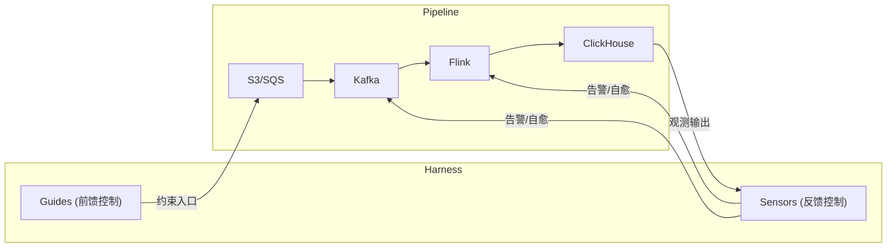
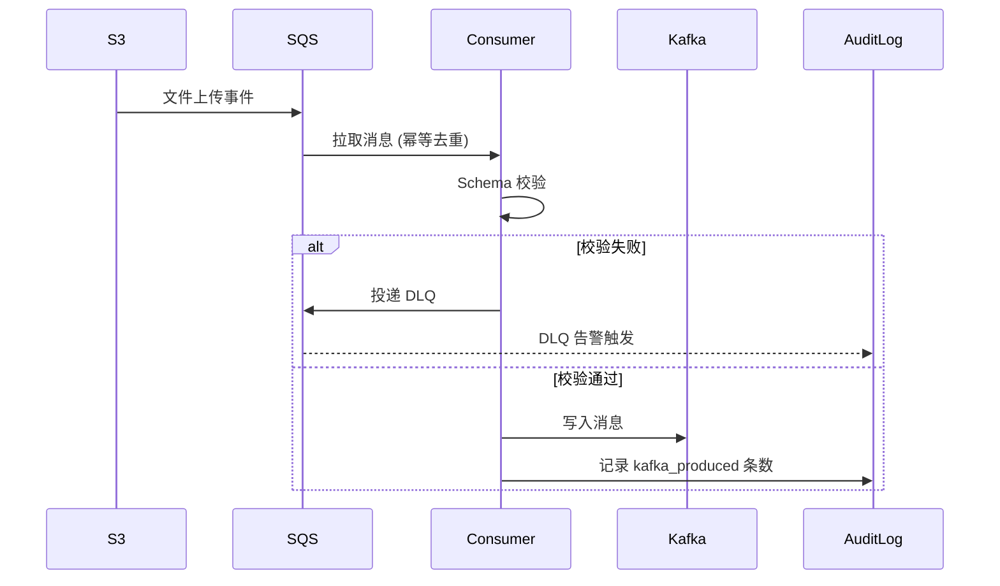
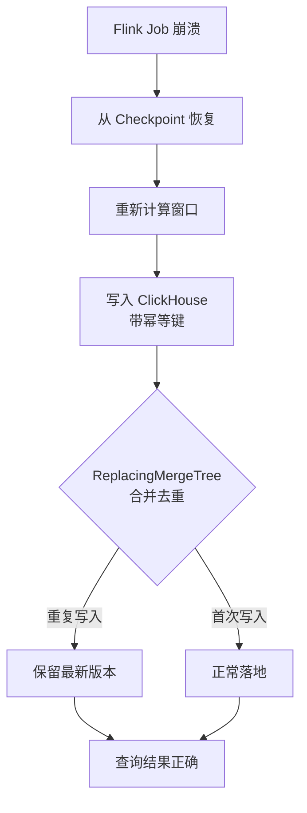
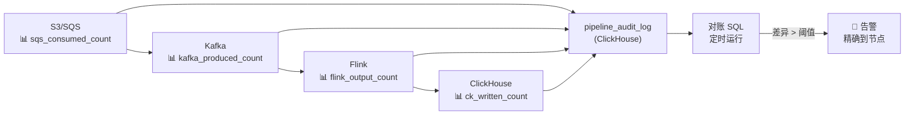

凌晨3点，手机震动。ClickHouse 的数据量告警：今日入库条数比昨日少了 17 万条。

你打开 Flink UI，Job 状态是绿的。翻 Kafka Consumer Lag，数值正常。看 S3 的文件清单，文件都在。

数据到底去哪了？

这是大数据管道最典型的困境：**管道是一条看不见接缝的流水线，任何节点出问题，影响都在最下游才被发现**。等你定位到根因，可能已经过去了4个小时。

<!-- more -->

## 从 AI 到数据管道：Harness Engineering 的迁移

Martin Fowler 在 [Harness Engineering](https://martinfowler.com/articles/harness-engineering.html) 中提出了一个公式：

> **Agent = Model + Harness**

Harness 是模型之外的一切控制体系：前馈（Guides）预防偏差，反馈（Sensors）捕获异常并自愈。

把这个公式迁移到大数据领域，它变成：

> **Pipeline = Data + Harness**

- **Guides（前馈控制）**：在数据流入之前，通过 Schema 约束、命名规范、拓扑模板等手段，让异常数据根本不会进入管道。
- **Sensors（反馈控制）**：在每个节点埋入可观测性探针，数据一旦异常立刻感知，触发告警或自动修复。



本文沿着 `S3/SQS → Kafka → Flink → ClickHouse` 逐节拆解，每个节点给出一个真实痛点场景，以及对应的 Guides 和 Sensors 设计。

---

## 节点1：S3/SQS —— 消息幽灵

### 痛点场景

S3 新文件上传后触发 SQS 消息，消费服务将文件内容写入 Kafka。某次上线后发现：同一批数据在 Kafka 里出现了两次。排查发现 SQS 的消息可见性超时（Visibility Timeout）配置过短，消费服务还没处理完，消息就重新变为可见，被另一个消费者实例重复拉取。

这类问题的麻烦在于：**它不报错，所有组件状态都是绿的**，但数据已经悄悄翻倍了。

### Guides（前馈设计）

**① Schema Contract（数据契约）**

在 S3 文件写入前，强制约定 Schema 格式（推荐 Avro + Schema Registry）。消费服务在读取文件时先做 Schema 校验，格式不符直接投递 DLQ，拒绝进入 Kafka。

```
# Schema Registry 注册示例（Avro）
{
  "type": "record",
  "name": "UserEvent",
  "fields": [
    {"name": "event_id", "type": "string"},
    {"name": "user_id", "type": "string"},
    {"name": "event_time", "type": "long"},
    {"name": "event_type", "type": "string"}
  ]
}
```

**② SQS 消费幂等设计**

利用 SQS FIFO 队列的 `MessageDeduplicationId`（基于 S3 文件的 ETag 或路径 Hash），保证同一文件触发的消息在5分钟去重窗口内只被处理一次。

```python
# 发送 SQS FIFO 消息时，用 S3 文件 ETag 作为去重 ID
sqs.send_message(
    QueueUrl=queue_url,
    MessageBody=json.dumps({"s3_key": s3_key, "etag": etag}),
    MessageGroupId="s3-events",
    MessageDeduplicationId=hashlib.md5(etag.encode()).hexdigest()
)
```

**③ S3 文件命名规范**

文件名必须包含：`{date_partition}/{source}/{batch_id}/{timestamp}_{uuid}.{ext}`

`batch_id` 作为下游对账的最小单位，`uuid` 保证同一批次不同文件不重名。

### Sensors（反馈设计）

**① DLQ 深度告警**

Dead Letter Queue 的积压深度是最灵敏的前置告警。规则：`DLQ 消息数 > 0` 立即告警，不要等到积压成百上千条。

**② 入 Kafka 条数对账**

消费服务每处理完一个 `batch_id` 的文件，向 ClickHouse 的 `pipeline_audit_log` 表写入一条记录：

```sql
-- pipeline_audit_log 表结构
CREATE TABLE pipeline_audit_log (
    batch_id     String,
    stage        String,   -- 'sqs_consumed' | 'kafka_produced' | 'flink_output' | 'ck_written'
    record_count UInt64,
    event_time   DateTime,
    extra        String    -- JSON，存放额外上下文
) ENGINE = MergeTree()
ORDER BY (batch_id, stage, event_time);
```



---

## 节点2：Kafka —— Lag 雪崩

### 痛点场景

某个 Flink Job 因为上游数据格式变更（新增了一个 nullable 字段），反序列化抛出异常，Job 持续重启。在重启期间，Kafka Consumer Lag 从 0 积累到 200 万条。Job 恢复后，Flink 试图以最大吞吐量追赶 Lag，导致 ClickHouse Sink 写入 QPS 飙升，触发 ClickHouse 的并发写入限制，形成第二次故障——**一个问题引发了雪崩**。

### Guides（前馈设计）

**① Topic 分区数规范**

分区数一旦确定很难缩减。设计规范：

- 按峰值吞吐量预估：`分区数 = ceil(峰值消息/s ÷ 单分区处理能力)`
- 预留50%余量，避免 Rebalance 压力
- 禁止在生产环境动态增加分区（会破坏 Key Hash 路由的有序性）

**② Consumer Group 隔离规范**

不同业务的 Flink Job 必须使用不同的 Consumer Group，避免 Lag 问题相互传染。命名规范：`{env}-{service}-{job_name}-cg`（例：`prod-riskengine-fraud-detect-cg`）。

**③ 消息 TTL 与积压上限**

为每个 Topic 设置 `retention.ms` 和 `retention.bytes`，防止无限积压。配合 Flink 的 `auto.offset.reset=latest` 策略，在 Lag 超过阈值时触发「跳过旧数据」的熔断机制（需业务评估可接受性）。

### Sensors（反馈设计）

**① Consumer Lag 多级告警**

```
- Warning：consumer_lag > 10万条，持续5分钟
- Critical：consumer_lag > 100万条，立即触发
- 告警内容必须包含：Topic名、Consumer Group、分区列表、Lag增长速率
```

**② 热分区检测**

单个分区流量超过所有分区均值的3倍时触发告警。通常意味着 Key 分布不均（如大量消息的 user_id 为 null，全部路由到同一分区）。

**③ Flink Lag 追赶速率限制（Sensors 反馈 → Guides 联动）**

在 Flink Job 中配置消费速率上限，防止追 Lag 时对下游造成冲击：

```java
// Flink KafkaSource 限速配置
KafkaSource<String> source = KafkaSource.<String>builder()
    .setBootstrapServers(brokers)
    .setTopics(topic)
    .setGroupId(consumerGroup)
    // 每个分区每秒最多消费 1000 条，追 Lag 时不会压垮下游
    .setProperty("max.poll.records", "1000")
    .build();
```

---

## 节点3：Flink —— Checkpoint 黑洞

### 痛点场景

一个5分钟滚动窗口的聚合 Job，因算子内存泄漏触发 OOM，Job 崩溃。从上次成功的 Checkpoint 恢复后，发现窗口边界附近的数据出现了重复计数：Checkpoint 时刻正好在窗口触发前，恢复后窗口重新计算，但部分数据已经写入了 ClickHouse。

这是流处理中经典的 **「Exactly-Once 的幻觉」**：框架保证了消息 Exactly-Once 投递，但业务语义上的幂等性需要应用层自己保证。

### Guides（前馈设计）

**① 算子拓扑模板**

根据业务类型，预定义标准算子拓扑模板，减少工程师随意组合带来的隐患：

| 场景 | 推荐拓扑 |
|------|----------|
| 日志 ETL | Source → Filter → Map → Sink |
| 窗口聚合 | Source → Watermark → Window → Aggregate → Sink |
| 流表 Join | Source → KeyBy → CoProcessFunction → Sink |
| 维表富化 | Source → Async I/O (LATERAL TABLE) → Sink |

**② 状态 TTL 强制配置**

所有有状态算子必须显式配置 TTL，禁止状态无限增长：

```java
StateTtlConfig ttlConfig = StateTtlConfig
    .newBuilder(Time.hours(24))
    .setUpdateType(StateTtlConfig.UpdateType.OnCreateAndWrite)
    .setStateVisibility(StateTtlConfig.StateVisibility.NeverReturnExpired)
    .build();

ValueStateDescriptor<UserSession> descriptor =
    new ValueStateDescriptor<>("user-session", UserSession.class);
descriptor.enableTimeToLive(ttlConfig);
```

**③ RocksDB + MiniBatch 标准参数**

大状态 Job 强制使用 RocksDB 后端，并开启 MiniBatch 减少磁盘 IO（详见[《Flink SQL 多流 Join 背压优化》](/2026/02/28/flink-sql-tuning-backpressure/)）：

```sql
SET 'state.backend' = 'rocksdb';
SET 'table.exec.mini-batch.enabled' = 'true';
SET 'table.exec.mini-batch.allow-latency' = '5s';
SET 'table.exec.mini-batch.size' = '5000';
```

### Sensors（反馈设计）

**① Checkpoint 三项指标**

| 指标 | 告警阈值 | 含义 |
|------|----------|------|
| Checkpoint 耗时 | > 配置间隔的 50% | 状态过大或 IO 瓶颈 |
| Checkpoint 失败次数 | 连续2次失败 | Job 即将不可用 |
| Checkpoint 对齐等待 | > 5s | 上游算子反压严重 |

**② 背压率监控**

```
backPressuredTimeMsPerSecond > 800ms → 算子严重背压
busyTimeMsPerSecond > 900ms → 算子 CPU 满载
```

两者同时触发，通常意味着需要扩容并发度或优化状态访问。

**③ ClickHouse Sink 幂等写入（Sensors → 自愈）**

在 Flink Sink 层，用 `batch_id + window_end` 作为幂等键，利用 ClickHouse 的 `ReplacingMergeTree` 在合并时去重，确保 Job 重启后重复写入不影响最终结果：

```sql
CREATE TABLE flink_window_result (
    batch_id     String,
    window_end   DateTime,
    user_id      String,
    event_count  UInt64,
    updated_at   DateTime DEFAULT now()
) ENGINE = ReplacingMergeTree(updated_at)
PARTITION BY toYYYYMMDD(window_end)
ORDER BY (window_end, user_id);
```



---

## 节点4：ClickHouse Sink —— 写入成功≠正确

### 痛点场景

Flink Sink 日志显示：写入成功，无报错。但业务查询时发现，某个时间段的数据条数明显偏少。排查发现：

1. 使用了 `ReplacingMergeTree`，但查询时忘记加 `FINAL`，读到了合并前的中间状态（重复数据）
2. 写入时使用了 `async_insert`，但 `async_insert_busy_timeout_ms` 配置过长，部分数据还在内存缓冲区时服务重启，数据丢失

写入 ClickHouse 是整个管道中**语义最复杂的节点**，「写入成功」只是 HTTP 200，不等于数据已持久化、已合并、已可查。

### Guides（前馈设计）

**① 分区键 + 排序键约束**

设计规范强制要求：
- `PARTITION BY` 必须包含时间列（按天或按月），避免单个分区过大
- `ORDER BY` 的第一列必须是高基数的过滤列（如 `event_time`, `user_id`）
- 禁止使用 `ORDER BY tuple()`（全量排序，写入极慢）

**② 表引擎选型决策树**

```
需要去重？
├── 是 → 需要实时去重？
│         ├── 是 → CollapsingMergeTree（显式折叠）
│         └── 否 → ReplacingMergeTree + FINAL 查询
└── 否 → 需要聚合？
          ├── 是 → AggregatingMergeTree / SummingMergeTree
          └── 否 → MergeTree（最简单，性能最好）
```

**③ async_insert 配置规范**

```xml
<!-- ClickHouse 服务端配置 -->
<async_insert>1</async_insert>
<wait_for_async_insert>1</wait_for_async_insert>  <!-- 必须等待写入确认，不能设为0 -->
<async_insert_max_data_size>10485760</async_insert_max_data_size>  <!-- 10MB 触发刷盘 -->
<async_insert_busy_timeout_ms>200</async_insert_busy_timeout_ms>   <!-- 200ms 超时强制刷盘 -->
```

### Sensors（反馈设计）

**① system.query_log 慢写检测**

```sql
-- 检测最近1小时写入耗时超过5秒的查询
SELECT
    query_start_time,
    query_duration_ms,
    written_rows,
    result_rows,
    query
FROM system.query_log
WHERE type = 'QueryFinish'
  AND query_kind = 'Insert'
  AND query_duration_ms > 5000
  AND event_time >= now() - INTERVAL 1 HOUR
ORDER BY query_duration_ms DESC
LIMIT 20;
```

**② Parts 数量健康检测**

Parts 数量过多是写入性能劣化的早期信号：

```sql
-- 检测 Parts 过多的表（超过 300 个 Active Parts 通常需要关注）
SELECT
    database,
    table,
    count() AS parts_count,
    sum(rows) AS total_rows,
    formatReadableSize(sum(bytes_on_disk)) AS disk_size
FROM system.parts
WHERE active = 1
GROUP BY database, table
HAVING parts_count > 300
ORDER BY parts_count DESC;
```

**③ 副本同步延迟监控**

```sql
SELECT
    database,
    table,
    replica_name,
    absolute_delay  -- 秒，超过60秒需告警
FROM system.replicas
WHERE absolute_delay > 60;
```

---

## 节点5：端到端对账 —— "数字消失了"

上面四个节点各自建立了 Guides 和 Sensors，但还缺少一条**贯穿全局的 Behaviour Harness**：当某个节点的数据出现损耗，能自动发现并定位到具体节点。

### 设计：水印计数器 + 对账链

在每个关键节点写入 `pipeline_audit_log`（已在节点1中定义），然后用一条 SQL 对账：

```sql
-- 端到端对账查询：找出各节点条数有差异的 batch_id
WITH stage_counts AS (
    SELECT
        batch_id,
        groupArray((stage, record_count)) AS stages
    FROM pipeline_audit_log
    WHERE event_time >= today()
    GROUP BY batch_id
)
SELECT
    batch_id,
    stages,
    -- 计算各阶段的条数差
    arrayFirst(x -> x.1 = 'kafka_produced', stages).2 AS kafka_count,
    arrayFirst(x -> x.1 = 'flink_output',   stages).2 AS flink_count,
    arrayFirst(x -> x.1 = 'ck_written',     stages).2 AS ck_count,
    kafka_count - flink_count AS kafka_to_flink_loss,
    flink_count - ck_count   AS flink_to_ck_loss
FROM stage_counts
WHERE kafka_count != ck_count  -- 只看有差异的批次
ORDER BY batch_id;
```

这条 SQL 每5分钟定时运行（通过 ClickHouse 的定时查询或外部调度），结果写入告警系统。**数据消失的节点，在这张表里一目了然**。



---

## 回到凌晨3点

如果上面这套 Harness 已经就位，今晚的故障响应会是这样：

1. **凌晨2:47**：`pipeline_audit_log` 对账 SQL 发现 `flink_output` 比 `kafka_produced` 少了17万条，精确告警：**Flink 节点数据损耗**
2. **凌晨2:48**：Flink Checkpoint 失败告警同步触发，日志显示某算子 OOM
3. **凌晨2:49**：工程师收到告警，已知是 Flink OOM 导致的数据损耗，范围缩小到单个 Job
4. **凌晨3:00**：扩容算子并发度，Job 从 Checkpoint 恢复，`ReplacingMergeTree` 自动处理重复写入

从「不知道数据去哪了」到「17分钟定位并恢复」，差别就在于 Harness 是否就位。

---

## 速查表

| 节点 | 最关键的 Guide | 最关键的 Sensor |
|------|----------------|-----------------|
| S3/SQS | SQS FIFO 幂等去重 | DLQ 深度 > 0 立即告警 |
| Kafka | Consumer Group 隔离 + 分区容量规划 | consumer_lag 增长速率 |
| Flink | 状态 TTL 强制配置 | Checkpoint 连续失败次数 |
| ClickHouse Sink | wait_for_async_insert=1 | system.parts 数量 |
| 端到端 | pipeline_audit_log 水印计数 | 对账 SQL 定时运行 |

---

## 结语

Harness Engineering 在大数据领域的本质，是把**「数据可信」从人工巡检变成系统自证**。

它不要求你重写管道，也不需要引入新的大型平台。从一张 `pipeline_audit_log` 表开始，从 DLQ 深度告警开始，从强制配置 `wait_for_async_insert=1` 开始——每一个 Sensor 都是你在管道里插下的一根探针，每一个 Guide 都是你为下一次故障提前筑起的防线。

当告警在凌晨2:47而不是3:00触发，当定位时间从4小时缩短到17分钟，Harness 的价值就显现出来了。

---

*延伸阅读：*
- *[Harness Engineering: 从理念到行动的调研报告](/2026/04/03/harness-engineering-methodology/)*
- *[Flink SQL 多流 Join 背压优化与 MiniBatch 状态调优实践](/2026/02/28/flink-sql-tuning-backpressure/)*
- *[Flink 连接 ClickHouse 实践](/2024/12/01/flink-connect-ck/)*
